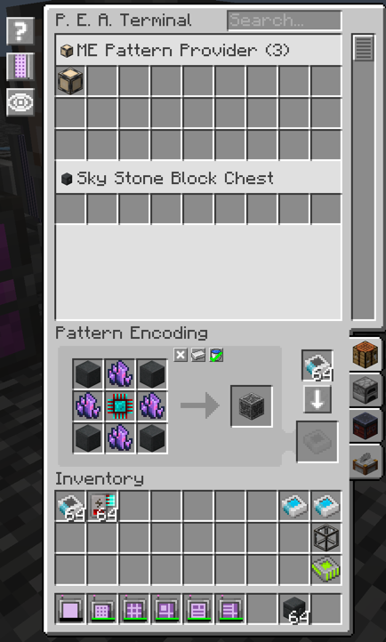

---
navigation:
  parent: index.md
  title: 样板编码访问终端
  icon: ae2peat:pattern_encoding_access_terminal
  position: 10
categories:
  - 工具
item_ids:
  - ae2peat:pattern_encoding_access_terminal
---

# 样板编码访问终端

样板编码访问终端合并了 AE2 的样板访问界面与编码界面，让你可以浏览存储的样板并直接原位编辑，无需更换部件。
将其安装在 ME 线缆上并连接至网络，即可在同一个屏幕中管理合成、处理、锻造以及切石配方。

## 配方

<RecipeFor id="ae2peat:pattern_encoding_access_terminal" />

## 界面展示

